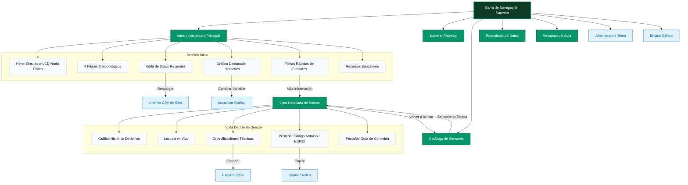

# EcoOpenSenseLab 🌿

Repositorio dedicado al proyecto de **Sensores de bajo costo y repositorios abiertos en la enseñanza de ecología**. 

Este sistema busca que el estudiantado participe de manera activa en todas las etapas del trabajo científico con datos ambientales: **Recolección**, **Documentación**, **Organización**, **Procesamiento**, **Visualización** e **Interpretación**.

---

## 🗺️ Mapa del Sitio (Sitemap & Estructura)

El portal está estructurado como una Aplicación de Página Única (SPA). A continuación se muestra el flujo de navegación y secciones del sitio (soportado de forma nativa en GitHub mediante Mermaid):



---

## 🛠️ Estructura del Proyecto

La organización del código fuente en la raíz es la siguiente:

```
EcoOpenSenseLab/
├── index.html          # Estructura e interfaz principal del portal (Dashboard y SPA)
├── style.css           # Estilos generales (Temas Claro Científico / Oscuro Glassmorphic)
├── app.js              # Controlador principal (Navegación, simulación y eventos)
├── hero_background.png # Imagen de fondo del Hero
└── js/
    ├── sensorRegistry.js   # Módulo de registro central para sensores activos
    ├── chartHelper.js      # Integración estética y configuración de Chart.js
    └── sensors/            # Módulos modulares individuales de sensores
        ├── temperature.js  # Sensor de Temperatura AHT21 (Datos y código)
        ├── humidity.js     # Sensor de Humedad AHT21 (Datos y código)
        └── airquality.js   # Sensor de Calidad del Aire EN160 (Datos y código)
```

---

## 🚀 Ejecución y Visualización Local

Al ser una aplicación web estática pura (HTML5/CSS3/JavaScript ES6), no requiere procesos de compilación complejos. Para visualizarla localmente:

1. Clona el repositorio:
   ```bash
   git clone https://github.com/chechenque/EcoOpenSenseLab.git
   cd EcoOpenSenseLab
   ```
2. Inicia un servidor local simple (por ejemplo, con Python):
   ```bash
   python3 -m http.server 8000
   ```
3. Abre tu navegador de preferencia e ingresa a:
   [http://localhost:8000](http://localhost:8000)

---

## 📦 Tecnologías y Librerías Utilizadas

* **Estructura y Estilos:** HTML5 semántico y CSS Vanilla personalizado (con variables dinámicas de tema).
* **Gráficos:** [Chart.js](https://www.chartjs.org/) (cargado vía CDN) para la graficación reactiva.
* **Iconografía:** [Lucide Icons](https://lucide.dev/) para iconos vectoriales limpios.
* **Fuente:** *Plus Jakarta Sans* y *Courier Prime* desde Google Fonts.
